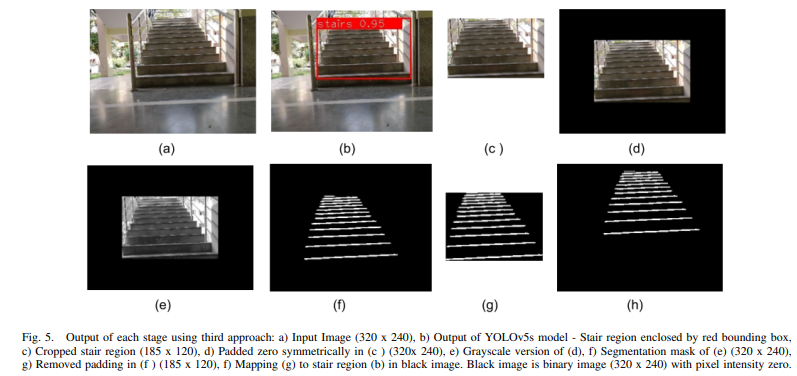
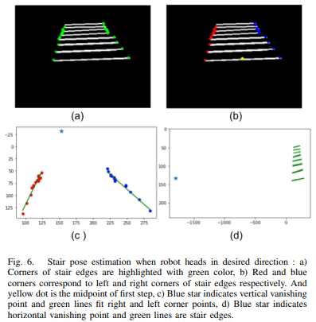
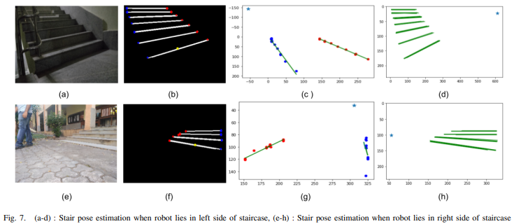

# Stair Pose Estimation

Designed an algorithm to estimate pose of stair with respect to camera of robot using Deep Learning and Computer Vision techniques

### Methodology:

1) SEMANTIC SEGMENTATION OF STAIR EDGES:

Stair region is cropped from the original image and padded with zero symmetrically along all four sides to increase the image size to 3 x 320 x 240. 
Semantic segmentation is then performed on this padded image to obtain a segmentation mask. Then this segmentation mask is mapped to stair region in black image. Black image is binary image (320 x 240) with pixel intensity zero. 

 

2) STAIR POSE ESTIMATION:

Segmentation Mask is then processed further Using Computer Vision.

1. Removed noise (e.g. white unwanted blobs) from segmentation mask using cv2.connectedComponentsWithStats

2. Joined broken lines in output using HoughLine Transformation.

3. Detected corners in image using cv2.cornerHarris

4. Calculated following geometric parameters of the staircase:
      (A) Staircase Area
      (B) Vertical Vanishing Point (Calculated using Regression)
      (C) Midpoint Coordinate of first step i.e. step closer to ground
      (D) Staircase Angle
      (E) Horizontal Vanishing Point (Using combination of 2 lines intersection is calculated for each, then its median value is considered as HVP)
 
5. Horizontal and Vertical vanishing points are then used to calculate Pose of Stair with respect to Camera Of Robot

Ideal case is when the robot reaches midpoint of first step and then rotates by required angle to attain desired direction i.e. headon position to stair. But in practice it is not always necessary to move robot closer to midpoint. Even if stair is not too close to railing side, heading direction is aligned along
desired direction and the robot is ready to climb the stairs safely. When aligned with staircase, stair edges seem to be parallel from point of view of robot.
as shown in above Figure 6. 

 

When the robot is located on the left side of the staircase as shown in Fig. 7(a-d), stair edges seem to intersect on the right side. Hence after reaching the midpoint of first step, it needs to rotate anticlockwise until stair edges will be parallel i.e. robot attains headon position. On the other hand if robot is located on the right side of staircase as shown in Fig. 7(e-h), stair edges seem to intersect on the left side and after reaching midpoint of first step, it needs to rotate clockwise until stair edges will be parallel. After each clockwise or anticlockwise rotation it is checked if coordinates of horizontal vanishing point exceeds the threshold value. If the horizontal vanishing point value is greater than the threshold defined, robot heads in the desired direction and is ready to climb the staircase.

 

3) DEPLOYING MODEL ONLINE:

Using Streamlit framework, web application is created and is deployed using Heroku. See Demo Video in results section.

### File Structure

|

### Results:

[RESEARCH PAPER](https://drive.google.com/file/d/1dkICxPhttYv9eMlcAFcu43WNYdF3IjJi/view?usp=drivesdk)  
This paper was presented in 1st International Conference on the Paradigm shifts in Communication, Embedded Systems,, Machine Learning and Signal Processing [PCEMS] 2022.

[DEMO VIDEO](https://drive.google.com/file/d/1dPF2OP07s0LW6-wLI2noRfTZ8BC8ct1r/view?usp=drivesdk)
