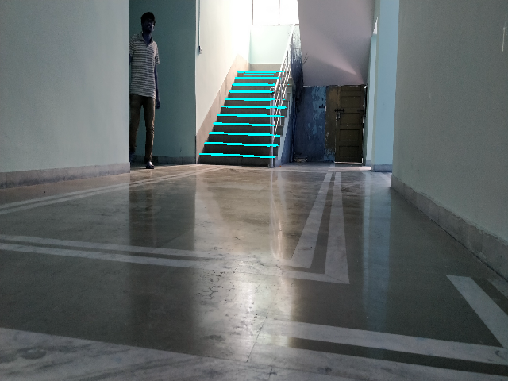
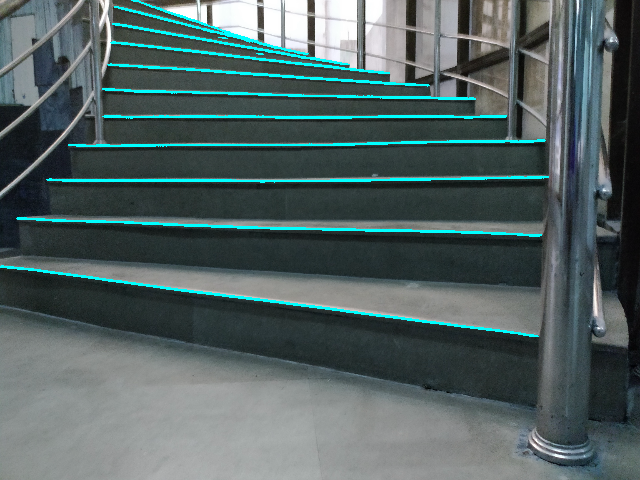

# Stair Pose Estimation

Designed an algorithm to estimate pose of stair with respect to camera of robot using Deep Learning and Computer Vision techniques

#### Repo Contains:

## 1.Training Code:

   * Used Resnet34 pretrained model for segmentation of stair edges using FastAI
   
   * Used Vertical and Horizontal vanishing points to furthur calculate translational and rotational values which are           
     later used to estimate pose of stair w.r.t camera of robot
     
   * If camera gets translated and rotated by calculated value, stairedges would appear parallel to camera and it 
     becomes easy for robot to climb stair.

#### Results:
Stair Edge is highlighted in cyan colour in follwing test set images:

* GOOD PREDICTIONS:

 
 
 
 

* PREDICTIONS WITH SOME FALSE POSITIVES \& FALSD NEGATIVES

 
 

* In some images edges different from stair edges are detected Example of such Image is as below:

 

This issue can be solved by firstly localizing stair in image using YOLO(or any other algorithm as YOLO is heavy and might cause lag when video is fed) then 
feeding detected part of image to model for edge detection.

## 2.StairPose Code:
1.Using cv2.connectedComponentsWithStats Noise is removed from image

2.Broken lines in output are joined using HoughLine Transformation.

3.cv2.cornerHarris is used to detect corners in image obtained from 2

4.Detected corners are used to calculate Vanishing Points

    * For vertical vanishing point :Regression method is used to fit line then itersection point is calculated
    
    * For horizontal Vanishing Point :Using combination of 2 lines intersection is calculated for each, then its median value is considered as vanishing point.
    
RESULTS OF CORNER DETECTION:

In first image broken lines are shown besides it image with joined lines and corners detected (in green),in second image left and right corners are highlighted with different colours(in red and blue)

   

These vanishing points are then use to calculate Pose of Stair with respect to Camera Of Robot
